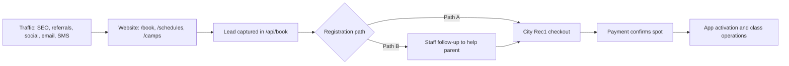

# LBTA Revenue Risk Register (Premortem)

**Date:** 2026-05-17  
**Owner:** Andrew Mateljan (decision owner), Saska/front desk (execution owner)  
**Scope:** Website -> trial -> City Rec1 payment -> active player operations, plus local listing integrity and marketing measurement.

**Companion docs:**
- `docs/lbta-registration-marketing-racquet-rescue-2026.md`
- `docs/lbta-system-map-2026.md`
- `docs/lbta-system-map-2026.json`
- `docs/audits/2026-05/scorecard.md`
- `docs/audits/2026-05/post-remediation/validate-summary.md`

---

## Executive Summary

The main business risk is not traffic. It is **handoff leakage**:

1. Parent raises hand on LBTA website.
2. Parent is sent to City Rec1 for payment.
3. LBTA does not receive definitive real-time payment completion.
4. Family falls through the cracks.

This creates silent losses in revenue, trust, and scheduling accuracy.

---

## Current Flow (Reality)

**Gap:** LBTA has good lead capture and decent event tracking, but no strict closed-loop enrollment confirmation tied to Rec1 payment completion.

---

## Known Frictions (Confirmed)

- City payment is external to LBTA website (parents can drop).
- City listing updates can lag schedule updates.
- Parent confusion: trial/app/lead does not equal spot held.
- Source attribution exists (GA4 events and `source` in `/api/book`) but close attribution to paid enrollment is weak.
- Android app links are inconsistent across assets (`com.court.laguna` vs `com.court.laguna`).
- Local listing and ranking verification is incomplete without Search Console + GBP evidence.

---

## Risk Scoring Method

- **Impact (1-5):** revenue/trust/operations damage if it happens.
- **Likelihood (1-5):** probability in normal operations.
- **Risk score:** `Impact x Likelihood` (max 25).
- **Priority bands:**  
  - `P0`: 16-25  
  - `P1`: 10-15  
  - `P2`: 6-9  
  - `P3`: 1-5

---

## Top 20 Risks

| ID | Domain | Failure mode | Impact | Likelihood | Score | Priority | Primary owner |
|----|--------|--------------|:------:|:----------:|:-----:|:--------:|---------------|
| R-001 | Enrollment handoff | Lead/trial submitted but City payment never completed | 5 | 5 | 25 | P0 | Front desk |
| R-002 | Enrollment handoff | Parent believes trial/app signup already reserved spot | 5 | 4 | 20 | P0 | Front desk + bot |
| R-003 | Enrollment handoff | Parent pays wrong City listing/session | 4 | 4 | 16 | P0 | Front desk |
| R-004 | Data sync | `/schedules` and Rec1 listing mismatch (timing lag) | 5 | 4 | 20 | P0 | Ops coordinator |
| R-005 | Attribution | No reliable lead->paid conversion by source/campaign | 5 | 4 | 20 | P0 | Marketing ops |
| R-006 | CRM ops | No `city_payment_status` stage causes unresolved leads | 5 | 4 | 20 | P0 | CRM owner |
| R-007 | Follow-up SLA | High-intent leads not contacted quickly enough | 4 | 4 | 16 | P0 | Front desk |
| R-008 | Messaging consistency | Bot/coaches/front desk give conflicting instructions | 4 | 4 | 16 | P0 | Ops + training |
| R-009 | Campaign hygiene | UTMs missing/inconsistent across SMS/email/social | 4 | 4 | 16 | P0 | Marketing ops |
| R-010 | Link integrity | Inconsistent Android app links reduce trust/conversion | 4 | 4 | 16 | P0 | Website owner |
| R-011 | Trial conversion | Trial attended but no structured same-day close task | 5 | 3 | 15 | P1 | Front desk |
| R-012 | Trial conversion | No-show trials have no recovery workflow | 4 | 3 | 12 | P1 | Front desk |
| R-013 | Inventory/capacity | City class fills while nurture still promises availability | 4 | 3 | 12 | P1 | Ops coordinator |
| R-014 | Website performance | Slow pages increase abandonment before CTA completion | 4 | 3 | 12 | P1 | Engineering |
| R-015 | Accessibility | Contrast/readability issues lower form completion | 3 | 3 | 9 | P2 | Engineering |
| R-016 | Listings/NAP | NAP inconsistency across directories weakens local trust | 4 | 3 | 12 | P1 | Marketing ops |
| R-017 | Local SEO | Rank assumptions made without GSC/GBP verification | 4 | 3 | 12 | P1 | Marketing ops |
| R-018 | Racquet Rescue ops | Stringing requests captured but unmanaged ticket flow | 3 | 4 | 12 | P1 | Front desk |
| R-019 | Racquet Rescue SLA | Same-day promise without capacity gating | 4 | 3 | 12 | P1 | Racquet Rescue lead |
| R-020 | Platform transition | ActiveCampaign -> GHL migration creates nurture gaps | 4 | 3 | 12 | P1 | CRM owner |

---

## Detection Signals and Mitigations (P0 and P1)

### R-001: Lead submitted, no City payment
- **Detect:** Daily report: leads older than 24h with no `city_payment_status=paid`.
- **Prevent:** Add explicit pipeline stage and SLA tasks at 2h/24h/72h.
- **Recover:** Manual call + direct Rec1 link + class name + hold note.

### R-002: Parent believes spot is confirmed without payment
- **Detect:** Support messages containing "I already signed up" but no payment record.
- **Prevent:** Repeat copy in modal, email, SMS: "Spot confirmed only after City payment."
- **Recover:** Priority callback script + exact payment steps.

### R-003: Wrong listing/session paid
- **Detect:** Parent reports wrong day/time after payment.
- **Prevent:** Send prefilled message templates with exact City listing name.
- **Recover:** Staff-led transfer workflow with City transfer policy disclosure.

### R-004: Schedule and City listing mismatch
- **Detect:** Weekly and pre-launch checklist comparison (`/schedules` vs Rec1 export).
- **Prevent:** "Publish parity checklist" gate before marketing send.
- **Recover:** Hotfix banner + SMS to affected cohort + manual holds.

### R-005: No source-to-paid visibility
- **Detect:** Marketing dashboard cannot report "paid enrollments by source."
- **Prevent:** Add `city_payment_status` and `payment_confirmed_at`; map source fields.
- **Recover:** Weekly manual reconciliation from City export to CRM.

### R-006: CRM stage ambiguity
- **Detect:** Leads stuck in generic "new" stage > 3 days.
- **Prevent:** Required status transitions: `new -> trial -> pending_city_payment -> paid`.
- **Recover:** Backfill statuses in batch; assign stale-lead owner.

### R-007: Slow follow-up SLA
- **Detect:** Median first response time > 4 business hours.
- **Prevent:** Auto task creation on each high-intent lead with owner + due time.
- **Recover:** End-of-day stale lead sweep and callback block.

### R-008: Conflicting instructions from team/bot
- **Detect:** QA transcripts where agents mention app/trial as payment confirmation.
- **Prevent:** Single approved script in bot KB and team SOP.
- **Recover:** Corrective outreach + KB update + retraining.

### R-009: UTM inconsistency
- **Detect:** GA4 source/medium bucket "(not set)" > 10% on conversion pages.
- **Prevent:** Enforce UTM builder and campaign naming template.
- **Recover:** Reclassify campaign links; fix templates before next send.

### R-010: Android link inconsistency
- **Detect:** Multiple package IDs found in repo or campaign templates.
- **Prevent:** Single canonical package ID in shared constants and templates.
- **Recover:** Replace all non-canonical links; resend corrected app CTA if needed.

### R-011: Trial attended with no close motion
- **Detect:** Trial attendance logged but no follow-up within same day.
- **Prevent:** Coach end-of-session trigger -> front desk conversion task.
- **Recover:** Next-day personalized outreach with recommended class and City link.

### R-012: Trial no-show unmanaged
- **Detect:** No-show record with no next action after 24h.
- **Prevent:** Auto no-show sequence (reschedule + reassurance).
- **Recover:** Phone-first outreach with alternative trial slot options.

### R-013: Availability drift
- **Detect:** City class full while website still showing available.
- **Prevent:** Daily class-capacity sync check before outbound campaigns.
- **Recover:** Offer nearest equivalent class and waitlist.

### R-014: Website speed drag on conversion
- **Detect:** LCP > 2.5s or low mobile conversion on high-traffic pages.
- **Prevent:** Ongoing perf budget and image/script governance.
- **Recover:** Prioritize quick wins on highest-converting pages first (`/book`, `/schedules`).

### R-016: Listing NAP inconsistency
- **Detect:** NAP audit shows phone/address variation across top citations.
- **Prevent:** Canonical NAP policy and monthly listing review.
- **Recover:** Correct listings in GBP, Yelp, Apple Maps, Bing Places, key directories.

### R-017: Ranking assumptions without evidence
- **Detect:** Decisions made without GSC queries, impressions, CTR, avg position.
- **Prevent:** Weekly rank evidence report (brand + non-brand).
- **Recover:** Freeze SEO claims until evidence dashboard is current.

### R-018: Racquet Rescue intake unmanaged
- **Detect:** Stringing requests in inbox without ticket/SLA metadata.
- **Prevent:** Single intake workflow with required fields and owner.
- **Recover:** Same-day triage board and customer confirmation messages.

### R-019: Same-day SLA overpromised
- **Detect:** Same-day requests accepted after noon with no capacity check.
- **Prevent:** Intake guardrails and cut-off logic in form copy + ops script.
- **Recover:** Immediate expectation reset + discounted priority slot if delayed.

### R-020: AC -> GHL transition gap
- **Detect:** New leads not appearing in expected nurture path.
- **Prevent:** Dual-run period with parity checklist before AC decommission.
- **Recover:** Re-enroll affected leads and backfill campaign history where possible.

---

## Required Operating Dashboard (Daily)

Track these 10 metrics every day:

1. New leads (website)
2. Trials requested
3. Trials completed
4. Leads pending City payment >24h
5. Leads pending City payment >72h
6. City paid count (manual or integrated)
7. Lead->paid conversion rate
8. Median first response time
9. No-show recovery conversion rate
10. Top leak reason (categorical: no response, payment confusion, listing mismatch, schedule conflict, price, other)

---

## 30-Day Action Plan (Practical)

### Week 1
- Finalize canonical scripts:
  - "Spot is only confirmed after City payment."
  - "App helps operations; payment still occurs in City Rec1."
- Add/confirm CRM pipeline stages including `pending_city_payment` and `paid`.
- Set SLA automation: create tasks at +2h, +24h, +72h for unresolved pending-payment leads.

### Week 2
- Enforce UTM template and campaign naming policy.
- Build daily reconciliation sheet/process (City export -> CRM status update).
- Unify Android app link across site and active templates.

### Week 3
- Run first complete local listing audit (GBP/Yelp/Apple/Bing) against canonical NAP.
- Establish weekly rank evidence report from Search Console + GBP.

### Week 4
- Publish monthly risk review:
  - Top 5 incident patterns
  - SLA misses
  - Funnel drop-off by source
  - Priority mitigations for next month

---

## Canonical NAP Policy (for listings and citations)

**Business name:** Laguna Beach Tennis Academy  
**Primary address (public):** 1098 Balboa Ave, Laguna Beach, CA 92651  
**Primary phone:** (949) 534-0457  
**Primary site:** https://lagunabeachtennisacademy.com

**Facility references (secondary, not primary NAP):**
- 3300 Alta Laguna Blvd (Alta Laguna)
- 625 Park Ave (LBHS)
- 380 Third St (City registration office context only)

---

## Decision Notes

- This register is intentionally conservative: it assumes failures will happen and builds containment.
- The highest-value mitigation remains a closed loop for City payment confirmation.
- Until a direct City integration exists, strict daily reconciliation is non-negotiable.

---

## Machine-Readable Export

Structured version of this same register: `docs/lbta-risk-register-2026.json`

